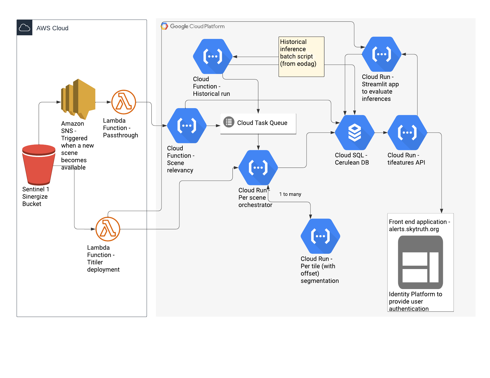

# cerulean-cloud
Pulumi repository with infrastructure for Cerulean, including all cloud services and database structure.

## Architecture

The cerulean-cloud architecture diagram can be found [here](https://lucid.app/lucidchart/26eb638d-3ba3-4461-aa1d-04ae4ec55d52/edit?viewport_loc=-2228%2C-1113%2C2759%2C3315%2CHowzCfBBZfS3&invitationId=inv_65f7accd-dc09-4ef1-9c28-81a34ce0976e#).



## Deployment

Deployment is fully managed by GitHub actions and Pulumi and the entire workflow defined in [this](.github/workflows/test_and_deploy.yml) YAML file. 

We have defined three development stages / stacks:
- __TEST__: this is the Work in Progress (WIP) deployment stage. Will often be broken. Deployment can be triggered to TEST using the [workflow_dispatch](https://github.blog/changelog/2020-07-06-github-actions-manual-triggers-with-workflow_dispatch/) from any branch.
- __STAGING__: this is the stable development deployment. Should be used to perform more complex integration tests, with close to real data. Deployment to STAGING is triggered with any merge commit to `main`.
- __PRODUCTION__: this is the production / publicly available deployment. Any deployment into PRODUCTION should pass rigorous integration tests in STAGING. Deployment can be triggered into PRODUCTION by adding a tag to a commit (`git tag v0.0.1 && git push --tags`).

__Pulumi deployments__

In order to make development easier we have defined two pulumi deployments that are intended to work in tandem:
- [cerulean-cloud-images](images/Pulumi.yaml): deploys all necessary docker images into Google Cloud Registry (GCR), in preparation for deploying the Cloud Run functions that require those images.
- [cerulean-cloud](Pulumi.yaml): deploys all cerulean-cloud infrastructure (except docker images).

For each of these deployments there exists a configuration directory that includes a YAML configuration file per stage / stack (named with the stage name itself i.e. `Pulumi.test.yaml`, `Pulumi.staging.yaml`, `Pulumi.production.yaml`). These files include configuration that is stage / stack specific, such as deployment regions, usernames and passwords for external services, etc. They should be managed using the Pulumi CLI (`pulumi config set someparam`) but can also be edited directly.

__Initial deployment__

If you are deploying a completely new stack, make sure to create matching configuration files in `cerulean-cloud-images` and `cerulean-cloud`, with matching stack names. In addition, specifically for the tifeatures deployment, since the database is empty when a stack is deployed for the first time (alembic migrations occur after the initial migration), if you want to access `tifeatures` after this initial deployment make sure to poll the `/register` endpoint of the resulting URL in order to correctly load the tables (i.e. `curl https://some-tifeatures-url.app/register`). For any deployments after the first one, this is not required.
## Authentication

Most services deployed with cerulean-cloud are safeguarded against abuse by outside actors using an API key authentication. This means that when interacting with the majority of the endpoints in your client of choice (i.e. `httpx` in Python, `curl` in your terminal, Postman or QGIS) you should make sure to include the following authentication header:

```json
{"Authorization": "Bearer SOME_API_KEY"}
```

The API_KEY we use is set on the stack configuration file with pulumi and is encrypted. In order to access the API key for the currently selected stack you can run:
```
pulumi stack output api_key
```

You could then save this value as an environment variable for later use.

The services deployed by cerulean-cloud that DO NOT require this API key are:
- Tifeatures Cloud Run
- Historical run Cloud Function
- Scene relevancy Cloud Function

## Development

In order to develop in cerulean-cloud repository we recommend the following system wide requirements (for MacOS), in addition to the python specific requirements listed below:
- [Docker](https://www.docker.com/products/docker-desktop/)
- [brew](https://brew.sh/)
- [Python 3.8](https://www.python.org/downloads/release/python-380/)
- [virtualenvwrapper](https://virtualenvwrapper.readthedocs.io/en/latest/install.html#)
- [Google Cloud Platform (GCP) CLI](https://cloud.google.com/sdk/docs/install)
- [Amazon Web Services (AWS) CLI](https://aws.amazon.com/cli/)
- [Pulumi](https://www.pulumi.com/docs/get-started/install/) - can be installed with `brew install pulumi`

### Setup cloud authentication
#### GCP authentication
```
gcloud config set account rodrigo@developmentseed.org
gcloud config configurations create cerulean --project cerulean-338116 --account rodrigo@developmentseed.org
gcloud config configurations activate cerulean
```

Also, make sure to authenticate into docker with GCP to allow interaction with GCR:
```
gcloud auth configure-docker
```
#### AWS authentication
```
aws configure --profile cerulean
export AWS_PROFILE=cerulean
```

### Setup your python virtualenv
```
mkvirtualenv cerulean-cloud --python=$(which python3.8)
pip install -r requirements.txt
pip install -r requirements-test.txt
# Additional requirements files included in this repo are reflected in the main requirements.txt
# Setup pre-commit
pre-commit install
```

## For notebook development
```
pip install ipykernel
python -m ipykernel install --user --name=cerulean-cloud
```
### Pulumi
#### Check available stages
```
pulumi stack ls
```
Select another stage
```
pulumi stack select test
```

#### Set config
Set secret values with (passwords, keys, etc):
```
pulumi config set db:db-password --secret
```

Set other config values with:
```
pulumi config set infra_distance
```
#### Preview changes
```
pulumi preview
```

#### Deploy changes
```
pulumi up
```

## Database

### Connecting

In order to connect to the deployed database, you can use the [Cloud SQL proxy for authentication](https://cloud.google.com/sql/docs/mysql/connect-admin-proxy). First install the proxy in your local machine (instructions [here](https://cloud.google.com/sql/docs/mysql/connect-admin-proxy#install)).

You can then find the instance connection name and the connection string in the outputs of your active pulumi stack:
```
pulumi stack --show-secrets
# use `database_instance_name` in Cloud SQL proxy
# use `database_url_alembic` to connect in your client
```

Start the Cloud SQL proxy (make sure you are properly authenticated with GCP):
```
  ./cloud_sql_proxy -instances=database_instance_name=tcp:0.0.0.0:5432
```

In another process connect to the database (i.e. with `psql`):
```
psql database_url_alembic
```

### Migrations

We are using [alembic](https://alembic.sqlalchemy.org/en/latest/tutorial.html) to run migration in our database. You can create a new revision using:
```
alembic revision -m "Add new table"
```
And apply this revision with:
```
# Ensure you have access to your database and have setup DB_URL environment variable with the connection string above
alembic upgrade head
```

During the deployment process with GitHub Actions, migrations will be automatically run when new revisions are included in the branch/commit.

## Troubleshooting

If pulumi throws funky errors at deployment, you can run in your current stack:
```
pulumi refresh
```
